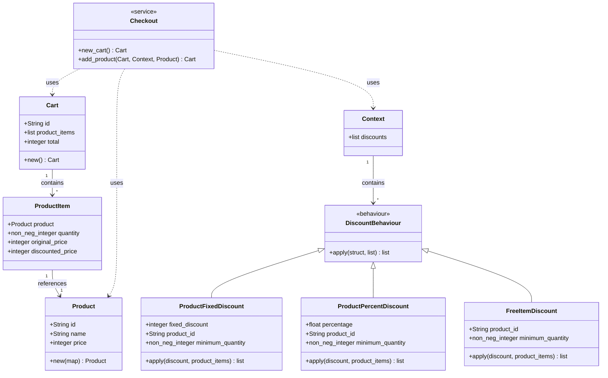

# Store

A toy store application.

## Overview

This project solves only the problems proposed. The author's reading was **how to structure discounts in a way that it can scale** and **money conversion to minimize rounding errors**.

- It uses integers to represent values in cents, in order to minimize rounding errors.
- It implements discounts as a `behaviour` in order to make it easily extensible.
- Products put in the checkout cart are converted to product items.

### Tests

- **Store requirement tests**: [store_test.exs](test/store/store_test.exs)
- **Unit tests for discounts**:
  - [product_fixed_discount_test.exs](test/store/discounts/product_fixed_discount_test.exs)
  - [product_percent_discount_test.exs](test/store/discounts/product_percent_discount_test.exs)
  - [free_product_discount_test.exs](test/store/discounts/free_product_discount_test.exs)
- **Unit tests for checkout cart**: [checkout_test.exs](test/store/checkout_test.exs)


### Diagram



### What it does not cover

It doesn't try to solve a myriad of problems that come with building an ecommerce:

- Stock
- Product Variants
- Multi Currency
- Cart lifecycle

## Prerequisites

### Option 1: Native Development (without Docker)

Choose a version manager and install plugins:

**[asdf](https://asdf-vm.com/):**
```bash
asdf plugin add erlang
asdf plugin add elixir
```

**[mise](https://mise.jdx.dev/):**
```bash
mise plugin install erlang
mise plugin install elixir
```

### Option 2: Docker Development

- [Docker](https://docs.docker.com/get-docker/)
- [Docker Compose](https://docs.docker.com/compose/install/)

## Setup & Running

### Native Development (without Docker)

1. **Install dependencies:**
   ```bash
   # With asdf:
   asdf install

   # With mise:
   mise install
   ```

2. **Get dependencies:**
   ```bash
   mix deps.get
   ```

3. **Compile the project:**
   ```bash
   mix compile
   ```

4. **Run tests:**
   ```bash
   mix test
   ```

5. **Start interactive Elixir shell:**
   ```bash
   iex -S mix
   ```

### Docker Development

1. **Start the application:**
   ```bash
   docker-compose up
   ```
   This will:
   - Pull the Elixir 1.18.3 image
   - Install dependencies
   - Compile the project
   - Start an interactive Elixir shell

2. **Run tests in Docker:**
   ```bash
   docker-compose exec store mix test
   ```

3. **Stop the application:**
   ```bash
   docker-compose down
   ```

4. **Rebuild if needed:**
   ```bash
   docker-compose up --build
   ```

## Usage

Once the application is running (either natively or in Docker), you can test it:

```elixir
iex> Store.Checkout.new_cart()
%Store.Cart{id: "abc12", product_items: [], total: 0}
```

### Running Tests

**Native:**
```bash
mix test
```

**Docker:**
```bash
docker-compose exec store mix test
```
